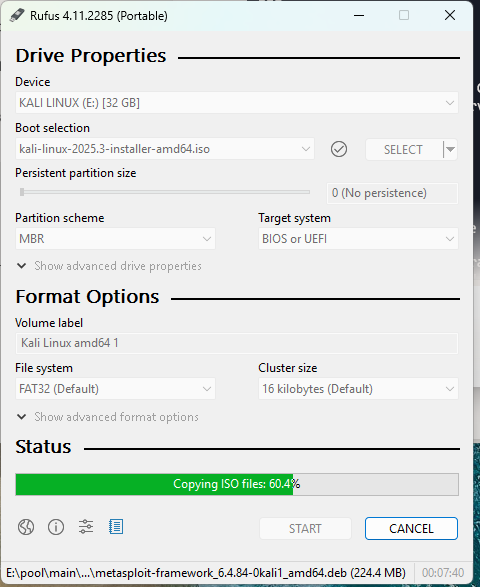
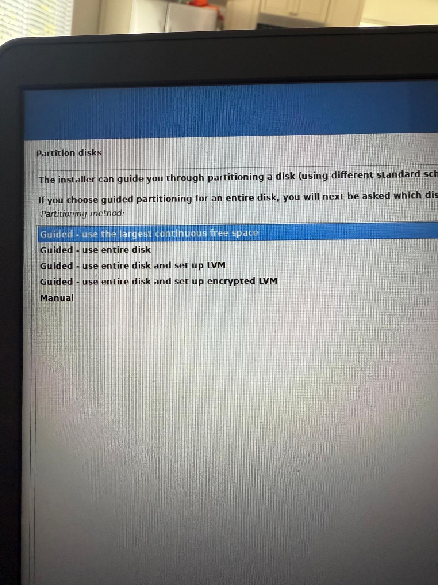
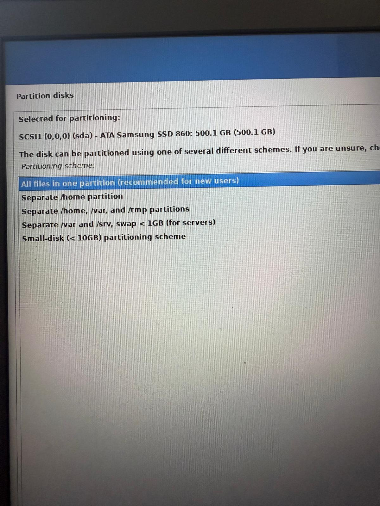
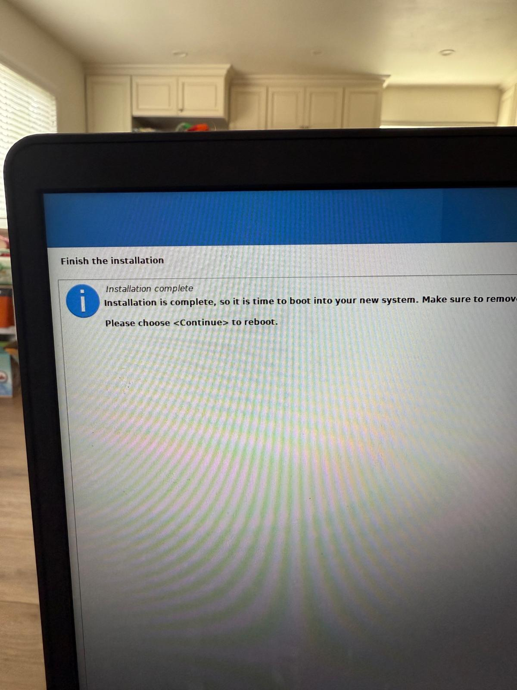

# ⚙️ Implementing Dual Boot (Windows + Kali Linux)

## 📝 Overview
This repository documents how I successfully implemented a **dual boot setup** on my secondary laptop, installing **Kali Linux** alongside Windows.  
The process highlights how to leverage unused hardware resources — in this case, an **unallocated 512GB SATA SSD** — to run multiple operating systems on one device.

---

## 🔎 Background
While exploring my BIOS settings, I noticed an additional SSD that wasn’t being used.  
Rather than leaving it idle, I decided to dedicate it to a second operating system: **Kali Linux**, perfect for returning to my labs and security practice.

---

## 🛠️ Steps Taken
1. **Prepared Installation Media**  
   - Downloaded **Rufus**
   
   - Created a bootable USB using the **Kali Linux ISO image**

  

2. **Booted into BIOS (Dell Laptop – F11)**  
   - Selected the USB drive as the boot device

3. **Installed Kali Linux**
   -Entered Hostname during Installation
     

   - Used the **guided partitioning method** to allocate the free 512GB SATA SSD
       
            

   
   - Configured username and device name during setup and finished
            

5. **Verified Dual Boot**  
   - Restarted the laptop  
   - Confirmed the bootloader presented options for **Windows** and **Kali Linux**
            

   - Successfully booted into both operating systems without issue
       

---

## ✅ Outcome
- Dual boot environment fully functional  
- Windows and Kali Linux coexist on the same device  
- Smooth transition between operating systems at startup  
- Ready to dive back into **labs and security testing** 🚀

---

## 📸 Screenshots
Screenshots of the installation and boot process are included in this repository for reference.

---

## 💡 Lessons Learned
- Unallocated hardware can be repurposed effectively for new operating systems  
- BIOS exploration often reveals hidden opportunities for optimization  
- Dual boot setups are a practical way to balance productivity (Windows) with experimentation (Kali Linux)

---

## 🏷 Tags
#DualBoot #KaliLinux #Windows #BIOS #SSD #Labs
